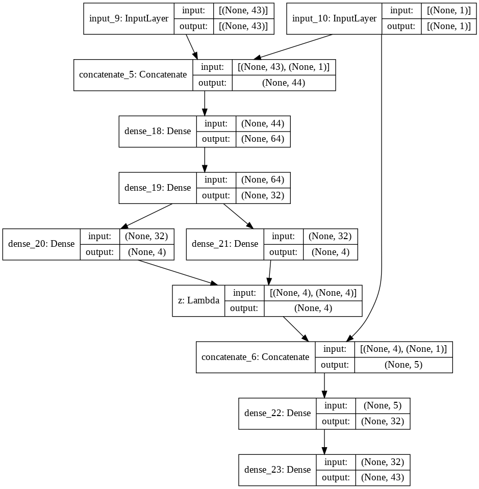
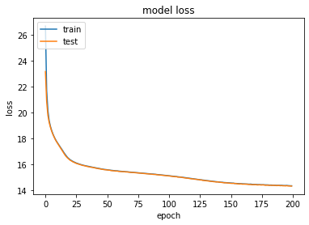
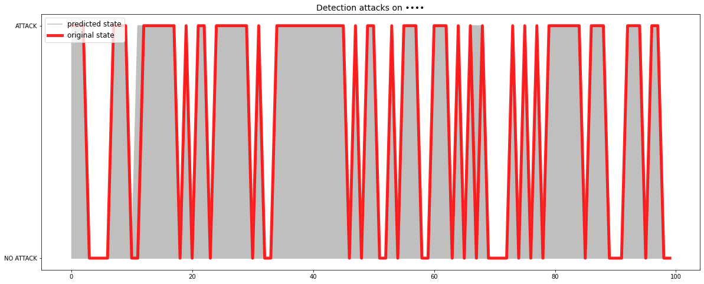

# Cyber-security-Attacks-detection
This project is about detecting cyber security attacks using  
Conditional Variational Autoencoder CVAE 

# Model architecture

# Evaluation
The model gave us a good result on testing data which is combination of attacks and no attacks.

| Metric        | value         |
| ------------- | ------------- |
| Accuracy      | 0.98          |
| F1-score      | 0.98          |

# Training and validation loss graph

# Detection graph for test data

